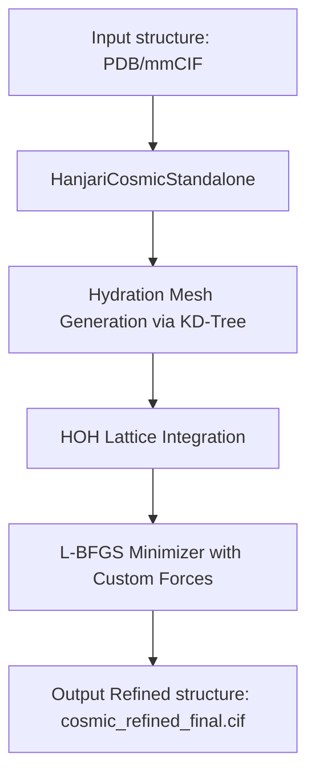

# 🌌 HanjariCosmicEngine

> **"Ultra-Fast Steric Clash Wash & Precision Water Mesh Weaver for AI-Predicted Proteins"**

> [!WARNING]
> **LICENSE NOTICE: FREE FOR ACADEMIC & NON-COMMERCIAL RESEARCH USE ONLY.**
> Commercial use is strictly restricted and requires a separate signed commercial contract. A prior signed agreement is **mandatory** for any commercial entity or commercial utilization.
> 
> **Terminology Clarification:** The suffix **"OS"** or Native Engine denotes **OpenMM Solvation Support** and does **NOT** signify "Open Source" under the Open Source Initiative (OSI) definitions. This suite operates under a custom Academic Research/Source-Available license.

---

`HanjariCosmicEngine` is a specialized, lightweight structural refinement module designed to eliminate severe atomic collisions (Steric Clashes), correct $C_\beta$ deviations, and construct $104.52^\circ$ bent explicit hydration layers in memory within seconds. 

Unlike heavy, memory-intensive packages, `HanjariCosmicEngine` uses localized spatial indexing to avoid large matrix allocations, preventing Out-Of-Memory (OOM) crashes even for massive assemblies.

### 💡 Relationship with CosmicDistiller OS
`HanjariCosmicEngine` is the **hydration and steric wash module** of the HanjariNebula suite. It is designed to be run as the **first stage** of structural idealization. It operates independently from `HanjariFold2_CosmicDistiller_OS.py` (which is a separate module focused on backbone dihedral relaxation and idealization). 

---

## 🛠️ Architecture and Key Features



* **Steric Clash Wash (Clashscore 0.0 target):** Employs custom non-bonded repulsive potentials to push overlapping atoms apart, dropping initial clashscores to zero.
* **Precision Water Mesh ($104.52^\circ$ Bent Geometry):** Uses localized $k$-d tree spatial searches to place explicit $H_2O$ molecules with ideal $104.52^\circ$ bonding angles without OOM crashes.
* **$C_\beta$ Zero-Deviation Restraint:** Enforces high-stiffness chiral volume and tetrahedral angle constraints to guarantee $C_\beta$ positions remain within $0.0\,\text{Å}$ of ideal geometry.
* **Phenix / CCTBX Independent:** Runs 100% natively on OpenMM backends.

---

## 🚀 Quick Start (3-Step Usage)

### 👶 Step 1: Environment Setup

🖥️ **Hardware Compatibility:** Fully supports both NVIDIA GPU (via CUDA/OpenCL for maximum speed) and standard CPU execution modes.

First, prepare a standard scientific Python environment. You can set it up quickly using Conda:

```bash
# 1. Create and activate a Virtual Environment
conda create -n cosmic_env python=3.10 -y
conda activate cosmic_env

# 2. Install OpenMM (Dynamic Physical Simulation Package)
conda install -c conda-forge openmm -y

# 3. Install core spatial indexing libraries
conda install scipy numpy -y
```

### 🏃 Step 2: Run the Cosmic Standalone Refiner
Go to the folder where the scripts are saved and run the entry script using standard Python, passing the path to the PDB or mmCIF file you want to refine:

```bash
# Accepts both .cif and .pdb formats automatically
python HanjariCosmicStandalone.py input_structure.cif --ph 7.4
```

### 🎁 Step 3: Verify the Outputs
Once started, the program prints real-time logs and automatically creates a folder named `V40_COSMIC_YYYYMMDD_HHMMSS/` in the same directory as the input file.
Inside this folder, you will find the refined structure file:
* **`cosmic_refined_final.cif`**: The physically relaxed, hydrated, and validation-ready macromolecular model.

---

## ⚖️ License & Terms

This software is distributed under a **Dual-licensing Scheme**:

1. **Academic & Educational Use**: 
   **Free of charge** for users affiliated with academic institutions, non-profit organizations, and for general scholarly research.
2. **Commercial Use**: 
   Any commercial utilization (including but not limited to contract research organizations (CROs), biotechnology companies, pharmaceutical firms, commercial consulting services, or product integration) **is strictly prohibited** without a separate signed commercial contract and payment of fees. Prior signed agreement is **mandatory** for any commercial entity or commercial utilization. Please read the full [LICENSE](LICENSE) file for detailed legal terms and restrictions.

---

## 🚨 MANDATORY CITATION POLICY

> [!IMPORTANT]
> **AS A CONDITION OF YOUR ACADEMIC LICENSE, YOU MUST CITE THIS SOFTWARE IN ANY PUBLICATION, PATENT, CODE REPOSITORY, RESEARCH POSTER, OR TALK RESULTING FROM DATA PROCESSED BY THE ENGINE.**
> 
> **Scientific Paper Status:** Under preparation (Pre-publication stage).
> **Mandatory Action:** Prior to the official publication of the peer-reviewed paper, users **must** cite this GitHub repository address.
> *Note: The post-publication journal template details listed below are purely hypothetical examples (placeholders) to illustrate the recommended citation format once the paper is officially released.*

### 📌 Pre-Publication Citation (Mandatory for Current Use):
Please cite the official GitHub repository:
```bibtex
@misc{hanjaricosmic_2026,
  author       = {Han, Byeong-gu and HanjariFold Authors},
  title         = {HanjariCosmicEngine: Ultra-Fast Steric Wash and Continuum Hydration Engine},
  year         = {2026},
  howpublished = {\url{https://github.com/bghan2024/HanjariNebula/tree/main/HanjariCosmicEngine}},
  note         = {GitHub Repository}
}
```
*Plain text alternative:*
> **HanjariCosmicEngine, HanjariFold Authors (2026), GitHub Repository: https://github.com/bghan2024/HanjariNebula/tree/main/HanjariCosmicEngine**

### 📌 Post-Publication Reference (Hypothetical Placeholder Example Only):
*Once the paper is officially published, update your citation to reference the peer-reviewed article as below (values below are illustrative examples only):*
```bibtex
@article{hanjari2026memory,
  author = {Hanjari and others},
  title = {Memory-Efficient Continuum Hydration for Ultra-Large Macromolecular Refinement},
  journal = {Journal of Molecular Biology},
  year = {2026},
  note = {In Preparation / CASP17 Proceedings}
}
```
*Plain text alternative:*
> **Hanjari, et al. (2026). "Memory-Efficient Continuum Hydration for Ultra-Large Macromolecular Refinement." Journal of Molecular Biology (or CASP17 Proceedings). [Under Preparation - Pre-print Placeholder]**

---

## 👩💻 Developer Info & Support

* **Author:** Han Byeong-gu
* **Email:** [hanbyeonggu@gmail.com](mailto:hanbyeonggu@gmail.com)
* **Organization:** HanjariFold Research Group
