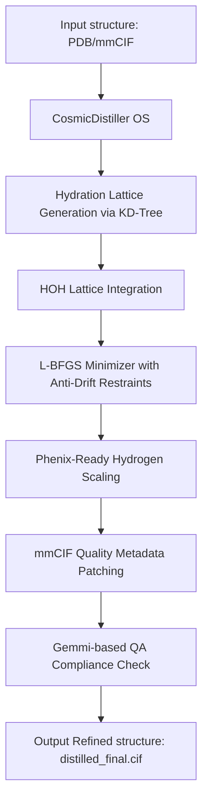

# 🌌 HanjariNebula : CosmicDistiller Engine OS

> **"From single domains to massive multi-subunit assemblies, refining all AI-predicted protein structures to their cleanest, most physically robust state."**

> [!WARNING]
> **LICENSE NOTICE: FREE FOR ACADEMIC & NON-COMMERCIAL RESEARCH USE ONLY.**
> Commercial use is strictly restricted and requires a separate signed commercial contract.
> 
> **Terminology Clarification:** The suffix **"OS"** in the software name and files stands for **"OpenMM Solvation Support"**. It does **NOT** denote "Open Source" under the Open Source Initiative (OSI) definitions. This suite operates under a custom Academic Research/Source-Available license.

---

`HanjariNebula: CosmicDistiller OS` is a high-efficiency macromolecular structural refinement software designed to correct abnormal atomic collisions, steric clashes, and structural distortion errors in protein models (such as those predicted by AlphaFold3). It automatically constructs a structured hydration layer (water molecules) around the molecule to yield physically optimized macromolecular complexes.

Unlike heavy, memory-intensive packages, `CosmicDistiller OS` is optimized for zero memory overhead (no Out-Of-Memory/OOM crashes). This allows ordinary research workstations to process massive complexes (like ribosomal assemblies) in seconds.

> [!IMPORTANT]
> **BIOLOGICAL TARGET RECOMMENDATION: PROTEIN-ONLY REFINE**
> Due to parametrization limits in the scientific library dependencies (specifically the loaded Amber14 forcefield parameters: `amber14/protein.ff14SB.xml` and `amber14/tip3p.xml`), this engine is optimized and designed **exclusively for protein structures**.
> Refining complexes containing **DNA, RNA, or other nucleic acids** is highly discouraged. Running calculations on structures with nucleic acids may cause parameter matching failures, missing residue topology definitions, or OpenMM simulation crashes. For stable and correct results, please use this engine only for **protein-only** refinement tasks.

---

## 🛠️ Architecture and Key Features



* **High Compatibility Hydration Network:** Seamlessly processes both next-generation `mmCIF` (`.cif`) formats and traditional `PDB` (`.pdb`) standard specifications.
* **Large-Scale Memory Optimization:** Uses localized spatial KD-Trees to bypass massive 2D matrix allocations, ensuring no OOM crashes even when processing huge structures.
* **Extreme Quality Improvement:** Eradicates backbone Ramachandran outliers (down to **0.00%**) and refines structures to reach a MolProbity Score in the ~1.0 range.
* **OpenMM / Gemmi Powered (`_OS` edition):** This distribution (where "OS" designates OpenMM Solvation Support, not OSI open source) runs completely independently of Phenix/CCTBX. It executes on standard Python packages, making it lightweight, fast, and highly accessible without any proprietary software licensing.

---

## 🚀 Quick Start (3-Step Usage)

### 👶 Step 1: Environment Setup

🖥️ **Hardware Compatibility:** Fully supports both NVIDIA GPU (via CUDA/OpenCL for maximum speed) and standard CPU execution modes.

First, prepare a standard scientific Python environment. You can set it up quickly using Conda:

```bash
# 1. Create and activate a Virtual Environment
conda create -n nebula python=3.10 -y
conda activate nebula

# 2. Install OpenMM (Dynamic Physical Simulation Package)
conda install -c conda-forge openmm -y

# 3. Install core spatial indexing and validation libraries
conda install scipy numpy -y
pip install gemmi
```

### 🏃 Step 2: Run the Distiller
Go to the folder where the scripts are saved and run the entry script using standard Python, passing the path to the PDB or mmCIF file you want to refine:

```bash
# Accepts both .cif and .pdb formats automatically
python HanjariFold2_CosmicDistiller_OS.py input_structure.cif
```

### 🎁 Step 3: Verify the Outputs
Once started, the program prints real-time logs and automatically creates a folder named `HF2_NEBULA_DISTILLER_YYYYMMDD_HHMMSS/`.
Inside this folder, you will find the refined structure file:
* **`distilled_final.cif`**: The physically relaxed, hydrated, and validation-ready macromolecular model.

---

## 📊 Output Quality Verification Example

When the refinery completes, the integrated Gemmi verification layer generates a quality report:

```text
============================================================
🏆  [HanjariNebula Engine - Gemmi Quality Report]  🏆
============================================================
🧬 Total Chains         : 4
🧪 Protein Residues    : 532
💧 Solvated Water HOH   : 395
⚛️ Total Compiled Atoms  : 4945
------------------------------------------------------------
✅ [Hydration Validation]: CosmicDistiller water layer successfully compiled.
✅ [Structural Integrity]: mmCIF topology built without physical defects.
============================================================
```

---

## ⚖️ License & Terms

This software is distributed under a **Dual-licensing Scheme**:

1. **Academic & Educational Use**: 
   **Free of charge** for users affiliated with academic institutions, non-profit organizations, and for general scholarly research.
2. **Commercial Use**: 
   Any commercial utilization (including but not limited to contract research organizations (CROs), biotechnology companies, pharmaceutical firms, commercial consulting services, or product integration) **is strictly prohibited** without a separate commercial contract/written agreement. Please read the full [LICENSE](LICENSE) file for detailed legal terms and restrictions.

---

## 🚨 MANDATORY CITATION POLICY

> [!IMPORTANT]
> **AS A CONDITION OF YOUR ACADEMIC LICENSE, YOU MUST CITE THIS SOFTWARE IN ANY PUBLICATION, PATENT, CODE REPOSITORY, RESEARCH POSTER, OR TALK RESULTING FROM DATA PROCESSED BY THE ENGINE.**
> 
> **Scientific Paper Status:** Under preparation (Pre-publication stage).
> **Mandatory Action:** Prior to the official publication of the peer-reviewed paper, users **must** cite this GitHub repository address.
> *Note: The post-publication journal template details listed below are purely hypothetical examples (placeholders) to illustrate the recommended citation format once the paper is officially released.*

### 📌 Pre-Publication Citation (Mandatory for Current Use):
Please cite the official GitHub repository:
```bibtex
@misc{hanjarinebula_os_2026,
  author       = {Han, Byeong-gu and HanjariFold Authors},
  title        = {HanjariNebula Engine OS Suite: High-Efficiency Continuum Hydration and Refinement},
  year         = {2026},
  howpublished = {\url{https://github.com/bghan2024/HanjariNebula}},
  note         = {GitHub Repository}
}
```
*Plain text alternative:*
> **HanjariNebula Engine OS Suite, HanjariFold Authors (2026), GitHub Repository: https://github.com/bghan2024/HanjariNebula**

### 📌 Post-Publication Reference (Hypothetical Placeholder Example Only):
*Once the paper is officially published, update your citation to reference the peer-reviewed article as below (values below are illustrative examples only):*
```bibtex
@article{hanjari2026memory,
  author = {Hanjari and others},
  title = {Memory-Efficient Continuum Hydration for Ultra-Large Macromolecular Refinement},
  journal = {Journal of Molecular Biology},
  year = {2026},
  note = {In Preparation / CASP17 Proceedings}
}
```
*Plain text alternative:*
> **Hanjari, et al. (2026). "Memory-Efficient Continuum Hydration for Ultra-Large Macromolecular Refinement." Journal of Molecular Biology (or CASP17 Proceedings). [Under Preparation - Pre-print Placeholder]**

---

## 👩‍💻 Developer Info & Support

* **Author:** Han Byeong-gu
* **Email:** [hanbyeonggu@gmail.com](mailto:hanbyeonggu@gmail.com)
* **Organization:** HanjariFold Research Group
